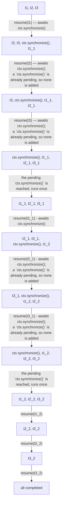

# mojo-gpu-async

A single-threaded async runtime for GPU-based Mojo coroutines.

```mojo
from max.gpu.host import DeviceContext
from gpu_async import Context, Executor


async def work(ctx: Context) -> Int:
    # ... launch GPU kernels via ctx.gpu_ctx() ...
    await ctx.synchronize()  # yield to the other queued tasks
    return 42


def main() raises:
    with DeviceContext() as ctx:
        var executor = Executor(ctx)
        var task = executor.add(work(executor.context()))
        executor.wait()
        print(task^.wait())
```

## Development

Requires [pixi](https://pixi.sh).

```sh
pixi run fmt    # format
pixi run test   # run tests (needs a GPU-enabled host)
pixi run docs   # build the API docs site
```

## How it works

- `Executor.add()` queues a task; nothing runs until `wait()`.
- `wait()` pops queued coroutines FIFO and resumes each in turn. A
  coroutine keeps running until it returns or `await`s
  `Context.synchronize()`, which hands control back to the executor.
- Only `await ctx.synchronize()` ever needs an actual device sync, and the
  executor fires it lazily — once, right before the first coroutine that's
  waiting on one resumes. Any other coroutine queued behind it rides that
  same sync for free instead of triggering its own.

### Example

Three tasks, each yielding twice, produce the schedule traced below:

```mojo
from max.gpu.host import DeviceContext
from gpu_async import Context, Executor


async def yield_twice(ctx: Context, name: String):
    print(name, "launch 1")  # ... launch GPU work via ctx.gpu_ctx() ...
    await ctx.synchronize()

    print(name, "launch 2")  # ... launch more GPU work ...
    await ctx.synchronize()

    print(name, "done")


def main() raises:
    with DeviceContext() as ctx:
        var executor = Executor(ctx)
        var t1 = executor.add(yield_twice(executor.context(), "t1"))
        var t2 = executor.add(yield_twice(executor.context(), "t2"))
        var t3 = executor.add(yield_twice(executor.context(), "t3"))

        executor.wait()

```



`t1_1`, `t2_1`, `t3_1` are not new tasks — each is the continuation of `t1`,
`t2`, `t3` picking up right after its `await ctx.synchronize()`. Once queued,
it's just a suspended coroutine waiting for the executor to resume it, same
as any other entry in the queue.

## License

Licensed under either of [Apache License, Version 2.0](LICENSE-APACHE) or
[MIT license](LICENSE-MIT) at your option.
